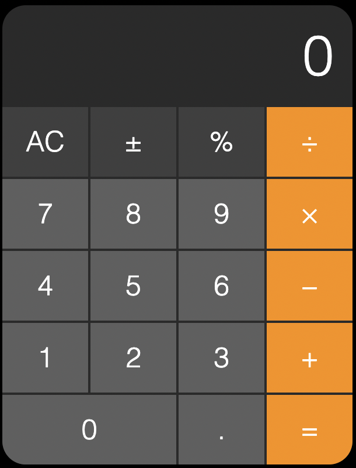
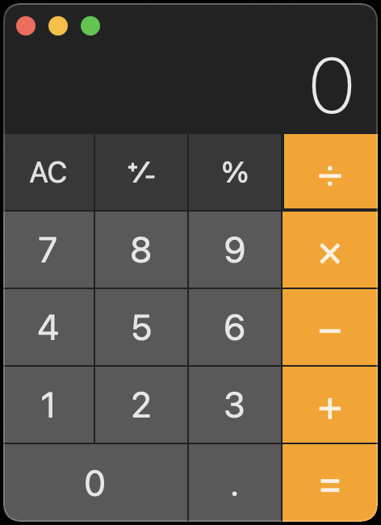

# JavaScript Calculator

## Description

A project to demonstrate the use of JavaScript and DOM manipulation, by recreating the Apple calculator app on a web page.

### 🚀 [Launch Live Project](https://austnly.github.io/js-calc/)

## Table of Contents

-   [Screenshots](#screenshots)
-   [Goals](#goals)
-   [Tech Stack](#tech-stack)
-   [Implementation](#implementation)
    -   [MVP](#mvp)
    -   [Plan](#logic-plan)
    -   [Issues Addressed](#issues-addressed)
-   [Future Additions](#future-additions)

## Screenshots

<figure>
<figcaption>Live Project Screenshot</figcaption>

</figure>

## Goals

-   To learn how to manipulate the DOM on user interaction using JavaScript EventListeners
-   For number and operator button clicks to trigger changes in the display, perform the math operation and output the correct result on the display
-   Use HTML/SCSS to reproduce the appearance of the following screenshot:

<figure>
<figcaption>Target to reproduce</figcaption>

</figure>

## Tech Stack

-   HTML
-   CSS/SCSS
-   JavaScript
-   Git

## Implementation

### MVP

HTML/SCSS

1. Create a calculator to be rendered to the html page
1. it should have number keys from 0 to 9
1. It should have operator keys (+, -, /, \*, =)
1. It should have a display rendering the current calculation in a box at the top
1. It should also have a "." key
1. You should choose a picture of a calculator from the Internet and reproduce it in HTML/SCSS

JavaScript

1. Should render the current calculation in a box at the top (calculator display)
1. It should handle decimals
1. It doesn't need to support orders of operation
1. It should not use eval() or Function() constructor

### Logic Plan

Prior to coding the JavaScript, I formed a plan for the logic of the calculator to help structure my subsequent working code.

1. Each button should have an EventListener to do _something_ when clicked
1. Number Buttons
    - Replace content of display if display 0 or previous button was an operator
    - Concatenate to display if display is a number or a .
1. . Button
    - Concatenate to current displayed number or 0
1. AC Button
    - Reset display to 0 and clear stored values
1. Operator Buttons
    - Evaluate any previous operations in memory involving current displayed value and any stored values, storing the result (all operator buttons should action an "=" first)
    - Store value currently on display if no previous operator
    - Store the operator that has just been clicked
    - Allow next number to be entered for current operation
1. +/- Button
    - Negate current displayed value and output to display
1. % Button
    - Divide current displayed number by 100 before evaluating any operations

### Code

-   Different buttons types were grouped by class
-   I iterated through the NodeList for the Operator and Number classes separately to apply EventListeners that would run different logic depending on if the button is an Operator or Number
-   The operands (previously displayed and current), and operator for the current operation are stored in global variables
-   I modularised the code, separating into generic DOM interactions (dom-utils.js), generic math functions (calc.js), and page-specific code (script.js).

### Issues Addressed

I encountered the following issues during implementation and implemented a fix for each case.

-   [x] Allow decimal place input
-   [x] Auto-add 0 to first place when making a new decimal number
-   [x] Prevent more than one decimal point being entered
-   [x] Long number overflow (over 10 characters) that doesn't fit the display => implemented the toExponential() method

## Future Additions

-   [ ] Different calculator style options
-   [ ] Additional buttons and operators for different styles
